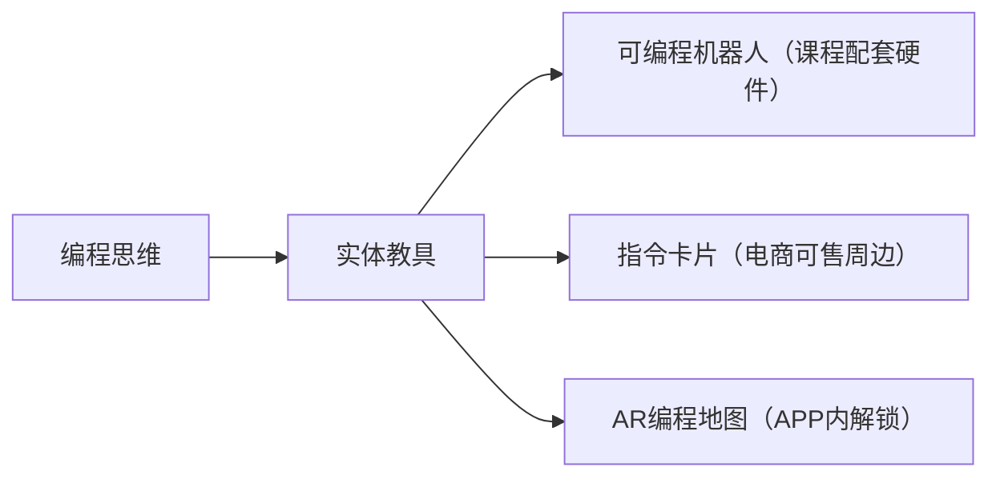
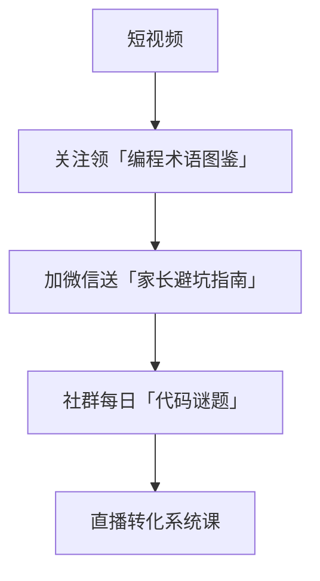

以下是专为您的背景和需求设计的**「英语编程教育自媒体」内容策略框架**，结合计算机博士的专业性、金融科技从业经验与育儿实践，打造差异化的知识付费转化路径：

---
### **一、内容定位三重奏**

**1. 身份标签强化**  
```python
identity = {
    "专业背书": "英国计算机博士 × 10年Fintech专家", 
    "育儿视角": "4岁男孩父亲亲自验证的教学法",
    "稀缺价值": "英语母语级编程思维培养"
}
```

**2. 受众分层设计**  

| 内容维度     | 吸引孩子                  | 打动家长          |
| -------- | --------------------- | ------------- |
| **表现形式** | 动画/游戏化/AR互动           | 教育方法论/未来竞争力分析 |
| **语言配比** | 70%英语+30%中文字幕         | 50%英语+50%中文解说 |
| **平台侧重** | YouTube Kids/Bilibili | 小红书/微信公众号     |

---

### **二、爆款视频选题库**
#### **A. 基础流量型（吸粉）**

1. **《和泽远玩代码》亲子系列**  
   - 拍摄真实教儿子编程的过程（刻意展示错误-修正过程）  
   - 示例：用Scratch Jr制作"会说话的生日贺卡"（植入英语指令教学）

2. **《博士爸爸的编程实验室》**  
   - 展示炫酷编程成果（如用Python控制智能家居）  
   - 每期结尾抛出思考题（引导关注获取答案）

3. **《10个让娃尖叫的代码魔法》**  
   - 快速实现视觉化效果（Python海龟绘图/Scratch动画）  
   - 设计成连续剧形式（每集解锁一个魔法咒语=代码指令）

#### **B. 教育焦虑型（转化）**

1. **《硅谷家长都在用的编程启蒙法》**  
   - 对比英美vs中国编程教育体系（用Fintech从业经历背书）  
   - 自然引出课程体系设计理念

2. **《从乐高到Python的成长路线图》**  
   - 绘制年龄-工具-能力三维坐标图（4-6岁/7-9岁/10+）  
   - 评论区提供免费测评工具（获取leads）

3. **《那些年我面试过的天才少年》**  
   - 讲述顶尖科技公司招聘案例（突出编程思维重要性）  
   - 片尾预告"培养方案私享会"直播

#### **C. 信任建立型（变现）**

1. **《用金融科技思维教编程》**  
   - 演示用Python模拟股票交易游戏（自然植入课程高阶模块）  
   - 提供简化版代码包（需填写邮箱获取）

2. **《泽远的编程作品展》**  
   - 展示4岁孩子用代码实现的成果（增强课程说服力）  
   - 设置"同龄人作品投稿"板块（UGC促进转化）

3. **《博士爸爸答家长20问》**  
   - 收集家长真实疑虑（设备选择/时间安排/成效评估）  
   - 片尾发放课程体验券

---

### **三、内容升级技巧**

**1. 教学道具设计**  


**2. 英语教学融合法**  

- **术语彩蛋**：在代码注释处设计单词挑战  
- **双语对照**：关键指令中英文逐帧显示  
- **发音挑战**：邀请观众跟读变量命名（如"velocity=速度"）

**3. 埋点转化设计**  

| 视频节点   | 转化策略   | 示例                  |
| ------ | ------ | ------------------- |
| 开头5秒   | 痛点提问   | "你知道英国5岁孩子在学什么语法吗？" |
| 中间1/3处 | 限时福利   | "评论'Python'送电子单词卡"  |
| 结尾     | 阶梯式CTA | 三步引导：关注→加群→领试听课     |
| 暂停页面   | 浮窗广告   | "卡住了？点击获取分步指南"      |

---

### **四、课程变现路径**

**1. 产品矩阵设计**  

| 层级     | 产品形态                | 定价策略     | 交付方式          |
|----------|-------------------------|--------------|-------------------|
| 引流层   | 7天编程挑战营           | 免费         | 社群+录播         |
| 入门层   | 动画英语编程课（Scratch）| 299/季度     | APP+实体卡片      |
| 进阶层   | Python金融小达人        | 1999/半年    | 直播课+模拟交易平台|
| 高净值层 | 1v1国际竞赛辅导         | 定制化       | Zoom+GitHub私库   |

**2. 私域运营动线**  


---

### **五、差异化竞争策略**

**1. 技术赋能内容**  

- 开发**「代码成果预览器」**H5工具：用户上传草图→生成简易代码效果  
- 创建**「编程英语发音库」**：用NLP技术评估孩子代码命名单词发音  

**2. 跨界内容联动**  

- 与乐高教育博主合作"机械结构+编程"专题  
- 邀请国际学校家长分享"双语编程学习体验"

**3. 数据驱动迭代**  

- 监控关键词：  
  ```python
  hot_topics = ['儿童编程装备','信奥赛准备','双语编程优势']
  ```
- 每周分析视频完播率拐点（优化内容节奏）

---

### **六、执行建议**

1. **设备方案**：  
   - 主相机：Sony ZV-E10（带眼部对焦）  
   - 麦克风：RODE VideoMic Pro+  
   - 虚拟背景：搭建实体编程元素墙（可贴孩子作品）

2. **发布节奏**：  
   - 每周3更（2条短视频+1场直播切片）  
   - 每月1条精品长视频（15分钟深度专题）

3. **起号测试**：  
   - 首月同时发布3类内容各5条，根据数据聚焦优势赛道  
   - 重点观察：  
     - 家长群体：完播率&收藏率  
     - 孩子群体：分享率&弹幕互动量

---

通过将计算机博士的专业深度、育儿实践的温度感与金融科技从业者的商业思维相结合，您的账号完全可能成为**「高知家长必看的编程教育IP」**。建议首期视频从《我在家用华尔街的方法教4岁儿子编程》这类跨界选题切入，快速建立差异化认知。